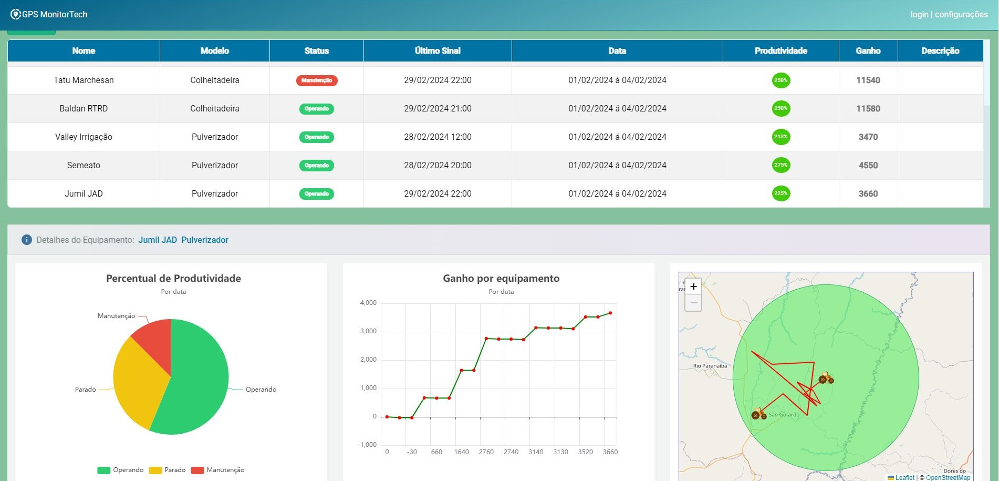
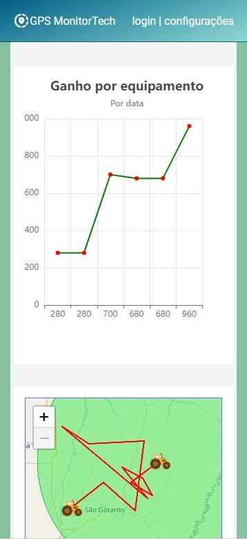

# GPS MonitorTech 

Este projeto foi desenvolvido utilizando os requisitos do Desafio frontend da Aiko.

Você pode visualizar o projeto funcionando [aqui](https://oliro.github.io/machine-monitoring/).

O **GPS MonitorTech** é um prototipo de sistema web SPA, responsivo e escalável, para coletar dados de equipamentos utilizados em operações florestais. Ele exibe o histórico de posições e estados dos equipamentos, proporcionando uma visão detalhada das atividades em campo. Este sistema  foi desenvolvido com tecnologias recentes e padrões de design para oferecer uma experiência eficiente e intuitiva.

## Funcionalidades

- **Visualização de Equipamentos no Mapa:** O sistema exibe os equipamentos em suas posições mais recentes em um mapa interativo.

- **Estado dos Equipamentos:** É possível visualizar o estado mais recente de cada equipamento, operando, parado ou em manutenção.

- **Histórico de Estados:** Ao clicar em um equipamento específico, é possivel ter acesso o histórico de estados por data, permitindo uma análise detalhada do comportamento ao longo do tempo.

- **Cálculo de Produtividade:** O sistema calcula a produtividade de cada equipamento com base nas horas produtivas em relação ao total de horas, proporcionando insights valiosos sobre a eficiência operacional.

- **Cálculo de Ganho:** Além disso, é possível calcular o ganho de cada equipamento com base no valor recebido por hora, informado no modelo do equipamento.

- **Histórico de Posições:** Acesso ao histórico de posições de cada equipamento, permitindo visualizar o trajeto realizado ao longo do tempo no mapa.

## Tecnologias Utilizadas

- **Angular 17:** O frontend da aplicação é desenvolvido com Angular 17, com proposito de ser moderno robusto e escalável.

- **SCSS:** Foi utilizado scss com metodologia BEM para o visual e para disposição dos elementos na interface que é organizada utilizando CSS Grid Layout, garantindo uma experiência responsiva e adaptável a diferentes dispositivos.

- **Angular Material:** Componentes do Angular Material são empregados em algumas partes para garantir melhor experiência ao usuário

- **Google Fonts/Icon:** Para uma boa experiência visual, são utilizadas fontes e ícones do Google.

- **Design Pattern:** A aplicação segue a arquitetura Core, Abstraction and Presentation Layer, garantindo uma separação clara de responsabilidades e facilitando a manutenção e evolução do sistema.

- **Facade Pattern:** Para abstração de regras de negócio complexas, é utilizado o padrão de projeto estrutural Facade, promovendo uma arquitetura modular e flexível.

- **SOLID e Clean Code:** Princípios SOLID e boas práticas de programação são aplicados para garantir um código limpo, legível e fácil de dar manutenção.

- **Gráficos e Tabelas Reativas:** O sistema utiliza serviços de gerenciamento de estado com RXJS para fornecer gráficos e tabelas reativos, garantindo uma visualização dinâmica e atualizada dos dados.

- **NGX-ECHARTS:** A biblioteca NGX-ECHARTS é empregada para a manipulação de gráficos interativos, proporcionando uma análise visual eficaz.

- **Leaflet + OpenStreetMap:** Para a manipulação de mapas, são utilizadas as bibliotecas Leaflet e OpenStreetMap, garantindo uma experiência de visualização precisa e detalhada.

- **Mockup com Json-server:** Durante o desenvolvimento, é utilizado o Json-server para simular o backend e fornecer dados fictícios para testes e prototipagem.

O **GPS MonitorTech**, é um prototipo de sistema de operações florestais que pode ser usado como uma ferramenta poderosa para monitorar, analisar e otimizar as atividades, garantindo maior eficiência e produtividade nas operações.

# MachineMonitoring

This project was generated with [Angular CLI](https://github.com/angular/angular-cli) version 17.2.0.

## Development server

Run `ng serve` for a dev server. Navigate to `http://localhost:4200/`. The application will automatically reload if you change any of the source files.

## Code scaffolding

Run `ng generate component component-name` to generate a new component. You can also use `ng generate directive|pipe|service|class|guard|interface|enum|module`.

## Build

Run `ng build` to build the project. The build artifacts will be stored in the `dist/` directory.

## Running unit tests

Run `ng test` to execute the unit tests via [Karma](https://karma-runner.github.io).

## Running end-to-end tests

Run `ng e2e` to execute the end-to-end tests via a platform of your choice. To use this command, you need to first add a package that implements end-to-end testing capabilities.

## Further help

To get more help on the Angular CLI use `ng help` or go check out the [Angular CLI Overview and Command Reference](https://angular.io/cli) page.
